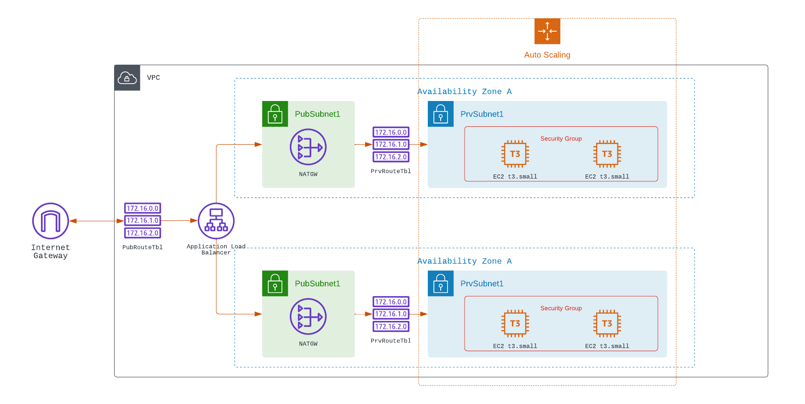

# Udacity Project: High Availability Deployment / CloudFormation

mailto:gerardo@onetechdude.com

## About Project

This project will deploy a a full indrastructure for deployment of web service with high availablility. The solution will prepare the following AWS components.
- The solution will be deployed on two seperate availability zones with auto scaling configuration.
- A load balancer will sit in front of the public network of each zone to balance the traffic generated by users
- Security groups will be created to only allow traffic on port 80.

## Diagram

(<a href="#top">back to top</a>)

## Dependencies

### AWS Requirements
1. A AWS account is required for this project.
2. AWS CLI Installation

### File Editor (Select One)
- Sublime
- VSCode
- Atom

### Register AWS CLI
- Register AWS CLI installation with your AWS Credentials.

## Getting Started

- You can modify the parameters of the deployment by modifuing the value slisted in "infra_params.json"
- When ready execute the below command.
- Go to the directory of the repro and run "npm install" to install package dependencies.
- ./create.sh myFirstStack network.yml network-parameters.json
./update.sh mySecStack servers.yml server-parameters.json

## Working Sample
Web Address: http://udaci-WebAp-7Q3BMX6B2O8N-76539188.us-east-1.elb.amazonaws.com

### Contact

Antonio Garcia
Mail: mailto:gerardo@onetechdude.com

(<a href="#top">back to top</a>)

